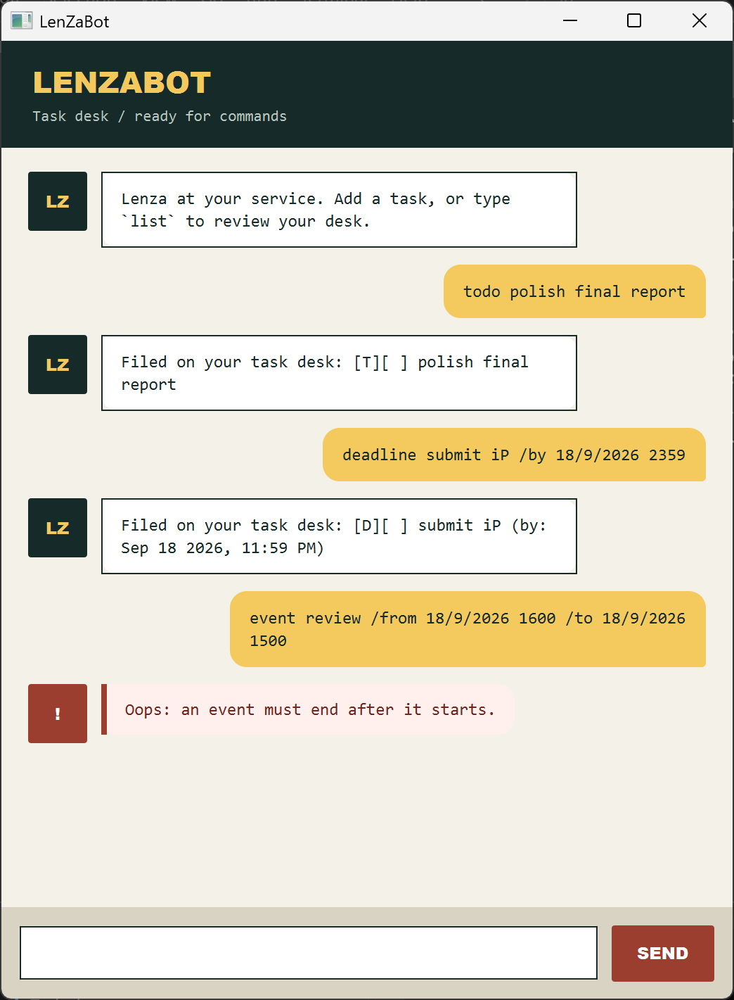

# LenZaBot User Guide

LenZaBot is a compact desktop task desk with a calm, practical assistant named
Lenza. It keeps todos, deadlines, and events in one local list and saves every
change automatically.

## Quick start

1. Download `LenZaBot.jar` from the latest GitHub release.
2. Ensure Java 25 is installed.
3. Open a terminal in the JAR's folder and run `java -jar LenZaBot.jar`.
4. Type a command in the field at the bottom and press Enter or click **SEND**.

LenZaBot creates `data/lenzabot.txt` beside the working directory from which it
is launched. A missing file is normal on the first run. Do not edit this file
while LenZaBot is open.

## Command summary

| Action | Command |
|---|---|
| Add a todo | `todo DESCRIPTION` |
| Add a deadline | `deadline DESCRIPTION /by DATE_TIME` |
| Add an event | `event DESCRIPTION /from DATE_TIME /to DATE_TIME` |
| Show all tasks | `list` |
| Mark a task complete | `mark NUMBER` |
| Mark a task incomplete | `unmark NUMBER` |
| Delete a task | `delete NUMBER` |
| Find tasks | `find KEYWORD` |
| Exit | `bye` |

Commands are case-insensitive and tolerate extra spaces. Task numbers are the
numbers shown by `list`.

## Adding tasks

### Todo

Use `todo` for a task without a date.

Example: `todo read the project brief`

### Deadline

Use `deadline` for a task due at a specific date or time.

Example: `deadline submit report /by 18/9/2026 2359`

Exactly one `/by` value is required.

### Event

Use `event` for an activity with a start and end.

Example: `event team meeting /from 18/9/2026 1400 /to 18/9/2026 1600`

Exactly one `/from` and one `/to` value are required. The end must be later
than the start.

## Date and time formats

LenZaBot accepts these formats:

| Input | Meaning |
|---|---|
| `18/9/2026 2359` | 18 Sep 2026, 11:59 PM |
| `2026-09-18 2359` | 18 Sep 2026, 11:59 PM |
| `18/9/2026` | 18 Sep 2026, midnight |
| `2026-09-18` | 18 Sep 2026, midnight |

Dates are checked strictly, so impossible dates such as `31/2/2026` are
rejected with guidance.

## Managing tasks

Use `list` to see the current numbered list. For example, `mark 2` completes
task 2, `unmark 2` makes it active again, and `delete 2` removes it.

Use `find` to search descriptions without regard to letter case.

Example: `find report`

Lenza reports clearly when the list is empty or no description matches.

## Command aliases

| Alias | Full command |
|---|---|
| `t` | `todo` |
| `d` | `deadline` |
| `e` | `event` |
| `ls` | `list` |

For example, `t read book` is equivalent to `todo read book`.

## Errors and recovery

Invalid commands appear in a red warning card and explain how to correct the
input. LenZaBot also handles storage problems without crashing:

- A missing save file starts a new empty task desk.
- Damaged save-file lines are skipped and reported at startup.
- A failed save is reported immediately; keep LenZaBot open and resolve folder
  permissions before making further changes.

Task descriptions cannot contain ` | ` because LenZaBot reserves it for the
save-file format.
